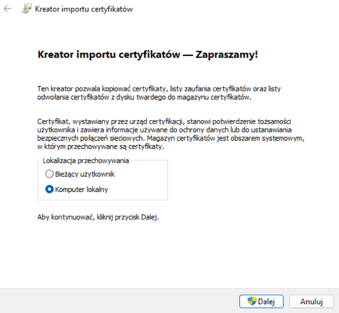
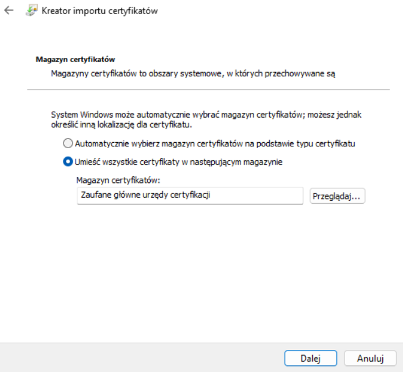
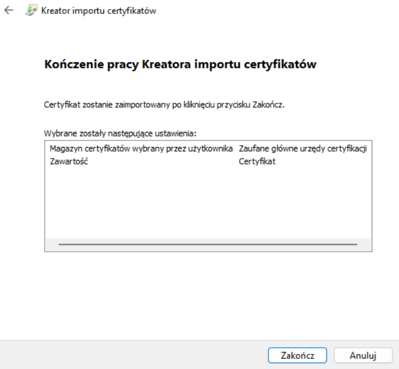
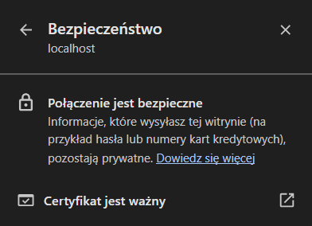
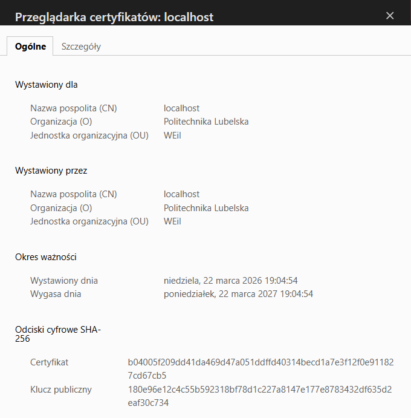

## Budowa obrazu
Zbudowanie obrazu o nazwie *web100* na podstawie utworzonego pliku [Dockerfile](Dockerfile):
```
docker build -t web100 .
```
Sprawdzenie, ile warstw posiada opracowany obraz:
```
docker history web100
```
```
IMAGE          CREATED          CREATED BY                                      SIZE      COMMENT
3ec73383cd10   20 seconds ago   CMD ["apache2ctl" "-DFOREGROUND"]               0B        buildkit.dockerfile.v0
<missing>      20 seconds ago   EXPOSE [80/tcp]                                 0B        buildkit.dockerfile.v0
<missing>      20 seconds ago   COPY index.html /var/www/html/index.html # b…   20.5kB    buildkit.dockerfile.v0
<missing>      20 seconds ago   RUN /bin/sh -c apt-get update &&  apt-get in…   112MB     buildkit.dockerfile.v0
<missing>      20 seconds ago   LABEL org.opencontainers.image.authors=Julia…   0B        buildkit.dockerfile.v0
<missing>      3 weeks ago      /bin/sh -c #(nop)  CMD ["/bin/bash"]            0B
<missing>      3 weeks ago      /bin/sh -c #(nop) ADD file:3f78aa860931e0853…   87.6MB
<missing>      3 weeks ago      /bin/sh -c #(nop)  LABEL org.opencontainers.…   0B
<missing>      3 weeks ago      /bin/sh -c #(nop)  LABEL org.opencontainers.…   0B
<missing>      3 weeks ago      /bin/sh -c #(nop)  ARG LAUNCHPAD_BUILD_ARCH     0B
<missing>      3 weeks ago      /bin/sh -c #(nop)  ARG RELEASE                  0B
```
lub
```
docker inspect web100 | jq ".[].RootFS"
```
```
{
  "Type": "layers",
  "Layers": [
    "sha256:f2a7f072635332d307212e318e07284948b89f4167fce5c4d7c9cfb7590b74b6",
    "sha256:35dca32d9626d77bd4b3264238ffd2b49b52c02756e903e9f2826a004a943433",
    "sha256:3e2cdb9e72185b0082ebdaa21d0888079ae61f0d8178eb4c7e6806e91641b99c"
  ]
}
```
Na podstawie powyższych informacji można stwierdzić, że utworzony obraz posiada **3 warstwy** (są to tylko te z niezerową wielkością).

## Uruchomienie kontenera
Uruchomienie kontenera na bazie opracowanego obrazu (np. z przekierowaniem portu 8080):
```
docker run -d -p 8080:80 web100
```
Strona WWW będzie dostępna pod adresem:<br>
[http://localhost:8080](http://localhost:8080)

## Przesłanie obrazu do repozytorium na Docker Hub
Otagowanie obrazu zgodnie z konwencją [SemVer](https://semver.org/):
```
docker tag web100:latest dragonika/web100:1.0.0
```
Przesłanie obrazu do repozytorium:
```
docker push dragonika/web100:1.0.0
```
Obraz jest dostępny w repozytorium pod adresem:<br>
[https://hub.docker.com/repository/docker/dragonika/web100](https://hub.docker.com/repository/docker/dragonika/web100)

## Konfiguracja i uruchomienie lokalnego rejestru obrazów
Wygenerowanie samodzielnie podpisanego certyfikatu (w ramach ćwiczeń dla domeny *localhost*):
```
openssl req \
	-newkey rsa:4096 -nodes -sha256 -keyout certs/domain.key \
	-addext "subjectAltName = DNS:localhost" \
	-x509 -days 365 -out certs/domain.crt
```
```
Country Name (2 letter code) [AU]:PL
State or Province Name (full name) [Some-State]:lubelskie
Locality Name (eg, city) []:Lublin
Organization Name (eg, company) [Internet Widgits Pty Ltd]:Politechnika Lubelska
Organizational Unit Name (eg, section) []:WEiI
Common Name (e.g. server FQDN or YOUR name) []:localhost
Email Address []:s101581@pollub.edu.pl
```
Uruchomienie lokalnego rejestru z użyciem wygenerowanego certyfikatu oraz możliwością usuwania obrazów:
```
docker run -d \
	--restart=always --name secure-registry \
	-v "%cd%\certs":/certs \
	-e REGISTRY_HTTP_ADDR=0.0.0.0:443 \
	-e REGISTRY_HTTP_TLS_CERTIFICATE=/certs/domain.crt \
	-e REGISTRY_HTTP_TLS_KEY=/certs/domain.key \
	-e REGISTRY_STORAGE_DELETE_ENABLED=true \
	-p 443:443 registry:2
```
Dodanie certyfikatu do zaufanych głównych urzędów certyfikacji w systemie Windows:





Weryfikacja certyfikatu w przeglądarce:




Próba połączenia z rejestrem za pomocą protokołu HTTP:
```
curl -X GET http://localhost:443/v2/_catalog
```
```
Client sent an HTTP request to an HTTPS server.
```
Próba połączenia z rejestrem za pomocą protokołu HTTPS:
```
curl -X GET https://localhost:443/v2/_catalog
```
```
{"repositories":[]}
```
Powyższe wyniki potwierdzają, że rejestr działa wyłącznie w trybie szyfrowanym (TLS). Serwer odrzuca połączenia nieszyfrowane, co jest pożądanym zachowaniem z punktu widzenia bezpiecznego dostępu do jego zasobów.

## Wykorzystanie lokalnego rejestru obrazów
Otagowanie obrazu w celu przesłania go do lokalnego rejestru:
```
docker tag web100:latest localhost:443/web100:1.0.0
```
Przesłanie obrazu do własnego rejestru:
```
docker push localhost:443/web100:1.0.0
```
Sprawdzenie zawartości rejestru:
```
curl -X GET https://localhost:443/v2/_catalog
```
```
{"repositories":["web100"]}
```
Sprawdzenie dostępnych tagów obrazu *web100*:
```
curl -X GET https://localhost:443/v2/web100/tags/list
```
```
{"name":"web100","tags":["1.0.0"]}
```
Pobranie obrazu po jego wcześniejszym usunięciu z lokalnego komputera:
```
docker pull localhost:443/web100:1.0.0
```
```
1.0.0: Pulling from web100
Digest: sha256:3ec73383cd10e33f065b2b23ce586a420ab4fd57e745f40f60e68e5be3076a2a
Status: Downloaded newer image for localhost:443/web100:1.0.0
localhost:443/web100:1.0.0
```
Sprawdzenie identyfikatora obrazu (Digest):
```
curl -I -H "Accept: application/vnd.oci.image.index.v1+json" \
	https://localhost:443/v2/web100/manifests/1.0.0
```
```
HTTP/1.1 200 OK
Content-Length: 855
Content-Type: application/vnd.oci.image.index.v1+json
Docker-Content-Digest: sha256:3ec73383cd10e33f065b2b23ce586a420ab4fd57e745f40f60e68e5be3076a2a
Docker-Distribution-Api-Version: registry/2.0
...
```
Usunięcie obrazu z rejestru przy użyciu poznanego Digest:
```
curl -X DELETE \
	https://localhost:443/v2/web100/manifests/sha256:3ec73383cd10e33f065b2b23ce586a420ab4fd57e745f40f60e68e5be3076a2a
```
Ponowne sprawdzenie dostępnych tagów obrazu *web100*:
```
curl -X GET https://localhost:443/v2/web100/tags/list
```
```
{"name":"web100","tags":null}
```
Wynik potwierdza, że obraz został poprawnie usunięty z rejestru.
