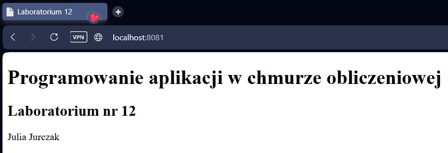

## Przygotowanie katalogów
Utworzenie następujących katalogów:
- `~/lab12/html` – zawiera wspólną stronę *HTML*, którą czytają wszystkie serwery,
- `~/lab12/web1`, `~/lab12/web2`, `~/lab12/web3` – dedykowane katalogi, do których poszczególne serwery zapisują logi.
```bash
mkdir -p ~/lab12/html ~/lab12/web1 ~/lab12/web2 ~/lab12/web3
```
Skopiowanie strony [index.html](index.html) zawierającej numer laboratorium oraz imię i nazwisko studenta do odpowiedniego katalogu:
```bash
cp index.html ~/lab12/html/
```
Weryfikacja utworzonej struktury:
```bash
tree ~/lab12/ 
```
```bash
/home/dragonika/lab12
├── html
│   └── index.html
├── web1
├── web2
└── web3

5 directories, 1 file
```
<br><br>
## Uruchomienie kontenerów
Utworzenie sieci mostkowej o nazwie *lab12net* z domyślnym sterownikiem *bridge*:
```bash
docker network create lab12net
```
Weryfikacja utworzonej sieci i jej konfiguracji:
```bash
docker network ls
```
```bash
NETWORK ID     NAME        DRIVER    SCOPE
42ff70cd88c0   bridge      bridge    local
ffa48f34d053   host        host      local
f620e5c6748b   lab12net    bridge    local
```
```bash
docker network inspect lab12net
```
```json
[
    {
        "Name": "lab12net",
        "Id": "f620e5c6748b6906a516453b7287467bfe3bb68b680a9f23aa19cc216a9d5ff7",
        "Created": "2026-06-09T17:48:23.92478615Z",
        "Scope": "local",
        "Driver": "bridge",
        "EnableIPv4": true,
        "EnableIPv6": false,
        "IPAM": {
            "Driver": "default",
            "Options": {},
            "Config": [
                {
                    "Subnet": "172.20.0.0/16",
                    "Gateway": "172.20.0.1"
                }
            ]
        },
        "Internal": false,
        "Attachable": false,
        "Ingress": false,
        "ConfigFrom": {
            "Network": ""
        },
        "ConfigOnly": false,
        "Options": {
            "com.docker.network.enable_ipv4": "true",
            "com.docker.network.enable_ipv6": "false"
        },
        "Labels": {},
        "Containers": {},
        "Status": {
            "IPAM": {
                "Subnets": {
                    "172.20.0.0/16": {
                        "IPsInUse": 3,
                        "DynamicIPsAvailable": 65533
                    }
                }
            }
        }
    }
]
```
Uruchomienie kontenera *web1*:
```bash
docker run -d --name web1 --network lab12net -p 8081:80 \
	--mount type=bind,source=${HOME}/lab12/html,target=/usr/share/nginx/html,readonly \
	--mount type=bind,source=${HOME}/lab12/web1,target=/var/log/nginx \
	nginx
```
Uruchomienie kontenera *web2*:
```bash
docker run -d --name web2 --network lab12net -p 8082:80 \
	--mount type=bind,source=${HOME}/lab12/html,target=/usr/share/nginx/html,readonly \
	--mount type=bind,source=${HOME}/lab12/web2,target=/var/log/nginx \
	nginx
```
Uruchomienie kontenera *web3*:
```bash
docker run -d --name web3 --network lab12net -p 8083:80 \
	--mount type=bind,source=${HOME}/lab12/html,target=/usr/share/nginx/html,readonly \
	--mount type=bind,source=${HOME}/lab12/web3,target=/var/log/nginx \
	nginx
```
Użyto następujących opcji:
- `-d` – tryb *detached* (kontener działa w tle),
- `--network lab12net` – podłączenie do utworzonej wcześniej sieci mostkowej,
- `-p 8081:80` – przekierowanie portu hosta 8081 na port 80 kontenera,
- `--mount type=bind,...,readonly` – wolumen typu *bind mount* zawierający stronę *HTML* (tylko do odczytu),
- `--mount type=bind,...` – wolumeny typu *bind mount* do zapisu logów przez *nginx*.
<br><br>
## Weryfikacja poprawnego wykonania zadania
Sprawdzenie działania utworzonych kontenerów:
```bash
docker ps -f name=web
```
```bash
CONTAINER ID   IMAGE     COMMAND                  CREATED         STATUS         PORTS                                     NAMES
a1bea7ef988f   nginx     "/docker-entrypoint.…"   3 minutes ago   Up 3 minutes   0.0.0.0:8083->80/tcp, [::]:8083->80/tcp   web3
c07abe09fed0   nginx     "/docker-entrypoint.…"   3 minutes ago   Up 3 minutes   0.0.0.0:8082->80/tcp, [::]:8082->80/tcp   web2
efda9284a337   nginx     "/docker-entrypoint.…"   3 minutes ago   Up 3 minutes   0.0.0.0:8081->80/tcp, [::]:8081->80/tcp   web1
```
Weryfikacja podłączenia kontenerów do sieci *lab12net*:
```bash
docker network inspect lab12net | jq '.[].Containers'
```
```json
{
  "a1bea7ef988ff88d706f2ca1fdb381708b6c764501326d020cebb02e8444492d": {
    "Name": "web3",
    "EndpointID": "bd37f2b292f58dd380a03a3bd3d6ff5c24408336655de5bfc84bf906a4fe5a04",
    "MacAddress": "8e:55:f5:88:52:09",
    "IPv4Address": "172.20.0.4/16",
    "IPv6Address": ""
  },
  "c07abe09fed06f04e47a9d1f4117bab80192ad9d20baee4d982b77d41db01572": {
    "Name": "web2",
    "EndpointID": "d0e2054430aecffe5f61d5b9d3595f3e716eba079bc25d784358007ee572ea10",
    "MacAddress": "22:a1:d2:9a:94:90",
    "IPv4Address": "172.20.0.3/16",
    "IPv6Address": ""
  },
  "efda9284a33727591e6bac8bfa6916f8b8bb8adeec70597900fc44d8b71a7dcd": {
    "Name": "web1",
    "EndpointID": "e19f57948e19a01ae8d5ea3f85eaf95b56db7f7b597fd9d30c4c92cd03d3dbe7",
    "MacAddress": "ea:67:c3:ac:5d:65",
    "IPv4Address": "172.20.0.2/16",
    "IPv6Address": ""
  }
}
```
Wynik polecenia potwierdza, że wszystkie trzy kontenery zostały podłączone do sieci *lab12net* i otrzymały adresy *IP* z tej samej podsieci.

Sprawdzenie wyświetlania strony *HTML* przez każdy z serwerów z poziomu przeglądarki:



Analogicznie zweryfikowano dostęp do serwerów pod adresami http://localhost:8082 oraz http://localhost:8083. Wszystkie serwery poprawnie wyświetlały tę samą stronę *HTML*.

Weryfikacja uprawnień wolumenów:
```bash
docker container inspect web1 | jq '.[].Mounts'
```
```json
[
  {
    "Type": "bind",
    "Source": "/home/dragonika/lab12/html",
    "Destination": "/usr/share/nginx/html",
    "Mode": "",
    "RW": false,
    "Propagation": "rprivate"
  },
  {
    "Type": "bind",
    "Source": "/home/dragonika/lab12/web1",
    "Destination": "/var/log/nginx",
    "Mode": "",
    "RW": true,
    "Propagation": "rprivate"
  }
]
```
Powyższy wynik potwierdza, że wolumen zawierający stronę *HTML* został zamontowany w trybie tylko do odczytu (`"RW": false`), natomiast wolumen przeznaczony na logi posiada uprawnienia do odczytu i zapisu (`"RW": true`).

Sprawdzenie, czy logi *nginx* zostały zapisane w katalogach hosta:
```bash
tree ~/lab12/
```
```bash
/home/dragonika/lab12/
├── html
│   └── index.html
├── web1
│   ├── access.log
│   └── error.log
├── web2
│   ├── access.log
│   └── error.log
└── web3
    ├── access.log
    └── error.log

5 directories, 7 files
```
Sprawdzenie zawartości przykładowego pliku z logami:
```bash
cat ~/lab12/web1/access.log
```
```
172.20.0.1 - - [09/Jun/2026:18:23:38 +0000] "GET / HTTP/1.1" 200 255 "-" "curl/8.5.0" "-"
172.20.0.1 - - [09/Jun/2026:18:23:48 +0000] "GET / HTTP/1.1" 200 255 "-" "Mozilla/5.0 (Windows NT 10.0; Win64; x64) AppleWebKit/537.36 (KHTML, like Gecko) Chrome/149.0.0.0 Safari/537.36" "-"
172.20.0.1 - - [09/Jun/2026:18:23:48 +0000] "GET /favicon.ico HTTP/1.1" 404 555 "http://localhost:8081/" "Mozilla/5.0 (Windows NT 10.0; Win64; x64) AppleWebKit/537.36 (KHTML, like Gecko) Chrome/149.0.0.0 Safari/537.36" "-"
172.20.0.1 - - [09/Jun/2026:18:24:16 +0000] "GET / HTTP/1.1" 200 255 "-" "Mozilla/5.0 (Windows NT 10.0; Win64; x64) AppleWebKit/537.36 (KHTML, like Gecko) Chrome/149.0.0.0 Safari/537.36" "-"
172.20.0.1 - - [09/Jun/2026:18:26:15 +0000] "GET / HTTP/1.1" 200 255 "-" "Mozilla/5.0 (Windows NT 10.0; Win64; x64) AppleWebKit/537.36 (KHTML, like Gecko) Chrome/147.0.0.0 Safari/537.36 OPR/131.0.0.0" "-"
172.20.0.1 - - [09/Jun/2026:18:26:15 +0000] "GET /favicon.ico HTTP/1.1" 404 555 "http://localhost:8081/" "Mozilla/5.0 (Windows NT 10.0; Win64; x64) AppleWebKit/537.36 (KHTML, like Gecko) Chrome/147.0.0.0 Safari/537.36 OPR/131.0.0.0" "-"
```
Obecność wpisów w pliku *access.log* potwierdza poprawne zapisywanie logów serwera *nginx* do katalogu zamontowanego z systemu hosta.

Weryfikacja komunikacji między przykładowymi kontenerami w sieci przy użyciu *curl* (obraz *nginx* nie zawiera narzędzia *ping*):
```bash
docker exec web1 curl web2
```
```
  % Total    % Received % Xferd  Average Speed   Time    Time     Time  Current
                                 Dload  Upload   Total   Spent    Left  Speed
100   255  100   255    0     0   108k      0 --:--:-- --:--:-- --:--:--  124k
<!DOCTYPE html>
<html lang="pl">
        <head>
                <meta charset="UTF-8">
                <title>Laboratorium 12</title>
        </head>
        <body>
                <h1>Programowanie aplikacji w chmurze obliczeniowej</h1>
                <h2>Laboratorium nr 12</h2>
                <p>Julia Jurczak</p>
        </body>
</html>
```
Otrzymanie strony *HTML* z kontenera *web2* potwierdza poprawne działanie komunikacji sieciowej między kontenerami oraz mechanizmu rozwiązywania nazw *DNS* w sieci *lab12net*.