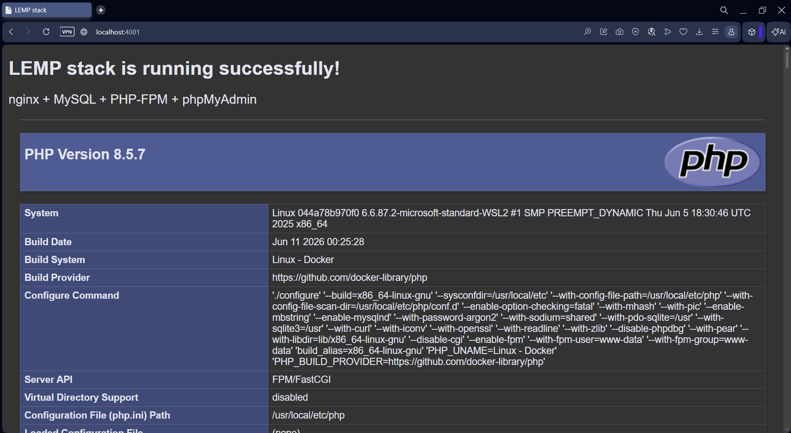
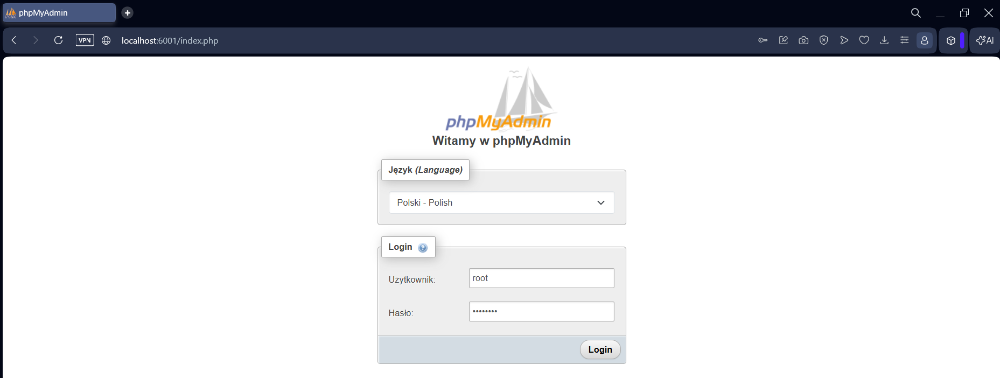
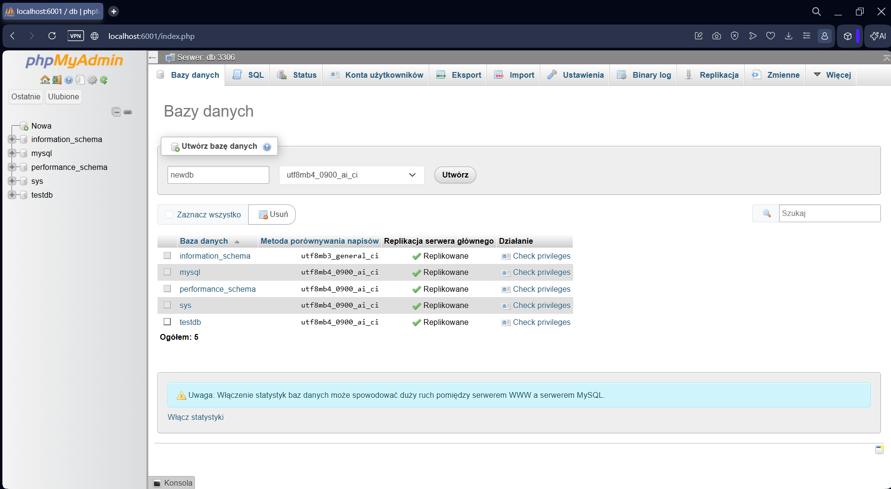
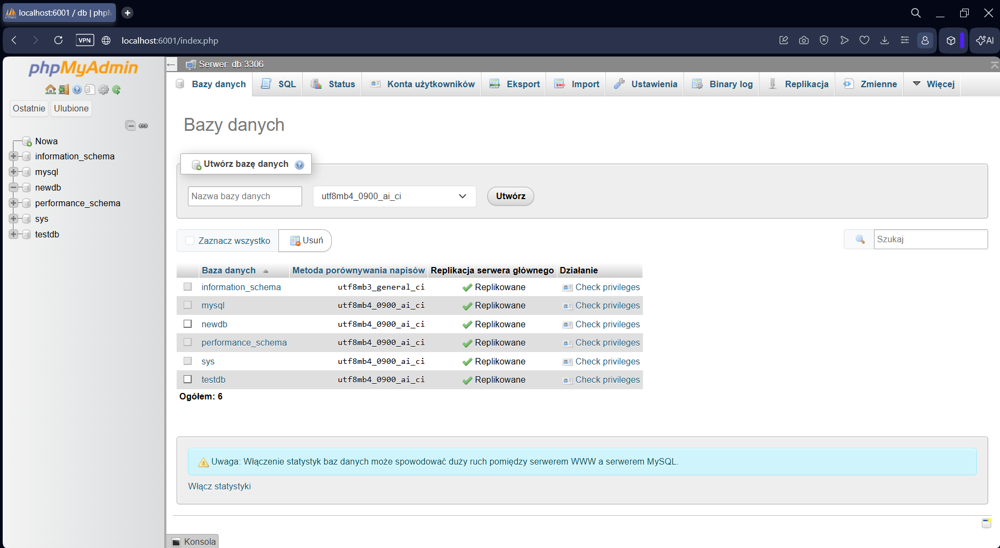

## Struktura projektu
```bash
.
├── docker-compose.yml
├── nginx
│   └── default.conf
├── secrets
│   ├── db_password.txt
│   └── db_root_password.txt
└── www
    └── index.php
```
Wszystkie dane wrażliwe (hasła) wykorzystywane przez aplikację *LEMP* zostały skonfigurowane jako **secrets** zamiast przekazywania ich jako jawny tekst w zmiennych środowiskowych. Są one odczytywane przez kontenery z katalogu `./secrects`, którego z oczywistych względów bezpieczeństwa nie należy umieszczać w publicznym w repozytorium na *GitHub*.
<br><br>
## Uzasadnienie wyboru sieci dla *phpMyAdmin*
Zgodnie z poleceniem, kontenery *php* i *db* są przyłączone tylko do sieci *backend*, natomiast *nginx* – do *backend* oraz *frontend*, ponieważ pełni rolę serwera WWW i pośredniczy w komunikacji pomiędzy użytkownikiem a aplikacją.

*phpMyAdmin* został przyłączony tylko do sieci *backend*, ponieważ musi mieć dostęp wyłącznie do serwera *MySQL* (kontener *db*), który również znajduje się w tej sieci. Nie ma potrzeby dodawania go do sieci *frontend*, gdyż nie komunikuje się z (potencjalnymi) pozostałymi usługami za jej pośrednictwem. Ograniczenie *phpMyAdmin* do jednej sieci zmniejsza powierzchnię ataku i jest zgodne z **zasadą minimalnych uprawnień**.

Pomimo braku połączenia z siecią *frontend*, *phpMyAdmin* jest dostępny z zewnątrz dzięki [opublikowaniu portu 6001](docker-compose.yml#L57-L58). Mapowanie portów działa niezależnie od przynależności kontenera do sieci *Docker*, dlatego aplikacja jest dostępna pod adresem http://localhost:6001, zachowując jednocześnie możliwość komunikacji z bazą danych przez sieć *backend*.
<br><br>
## Uruchomienie kontenerów
Uruchomienie kontenerów zdefiniowanych w pliku [docker-compose.yml](docker-compose.yml) w tle (bez blokowania terminala):
```bash
docker compose up -d
```
```bash
[+] up 64/64
 ✔ Image phpmyadmin:5.2.3      Pulled          24.8s
 ✔ Image php:8.5.7-fpm         Pulled          23.6s
 ✔ Image nginx:1.31.1          Pulled          13.6s
 ✔ Image mysql:9.7.0           Pulled          29.3s
 ✔ Network lemp-stack_frontend Created         0.0s
 ✔ Network lemp-stack_backend  Created         0.1s
 ✔ Volume lemp-stack_db_data   Created         0.0s
 ✔ Container db                Started         2.6s
 ✔ Container php               Started         2.5s
 ✔ Container phpmyadmin        Started         0.9s
 ✔ Container nginx             Started         1.0s
```
<br><br>
## Weryfikacja poprawnego wykonania zadania
Weryfikacja utworzonych kontenerów i ich statusów:
```bash
docker compose ps
```
```bash
NAME         IMAGE              COMMAND                  SERVICE      CREATED         STATUS         PORTS
db           mysql:9.7.0        "docker-entrypoint.s…"   db           4 minutes ago   Up 4 minutes   3306/tcp, 33060/tcp
nginx        nginx:1.31.1       "/docker-entrypoint.…"   nginx        4 minutes ago   Up 4 minutes   0.0.0.0:4001->80/tcp, [::]:4001->80/tcp
php          php:8.5.7-fpm      "docker-php-entrypoi…"   php          4 minutes ago   Up 4 minutes   9000/tcp
phpmyadmin   phpmyadmin:5.2.3   "/docker-entrypoint.…"   phpmyadmin   4 minutes ago   Up 4 minutes   0.0.0.0:6001->80/tcp, [::]:6001->80/tcp
```
Weryfikacja podłączenia kontenerów do odpowiednich sieci:
```bash
docker network inspect lemp-stack_backend | jq '.[].Containers'
```
```json
{
  "2171db02f40c91486afdcb1c340b39c2e1efeff212ac67ff058bfb05987a0130": {
    "Name": "php",
    "EndpointID": "7c8f19de548093ab808a7239de2fd1d8ac172cfd664c04b630df03058501d8a0",
    "MacAddress": "2e:ca:56:e7:cf:51",
    "IPv4Address": "172.24.0.2/16",
    "IPv6Address": ""
  },
  "34a2af10ad4e127dca8ffe47a66832eeed00a4121175175a2ba70026fdb7644b": {
    "Name": "phpmyadmin",
    "EndpointID": "56bd5e6e3a4cb6d8c7d015ed7675e55ddddc4b0500518e2f19c10d5a859c2154",
    "MacAddress": "1e:c6:d1:87:0a:4f",
    "IPv4Address": "172.24.0.4/16",
    "IPv6Address": ""
  },
  "60428394bed6c427a42ab285e523922d845b2ffdb144c315f4fad1f7b233e9a5": {
    "Name": "db",
    "EndpointID": "b9354aaaeba4a4cce3be598814e1e6c9232c53018d4824fd223250d6798dd825",
    "MacAddress": "1a:52:53:34:38:28",
    "IPv4Address": "172.24.0.3/16",
    "IPv6Address": ""
  },
  "efef30b14e335426569b5f4b4b624ba3a5f250a59ce5d0043587e9653b96e818": {
    "Name": "nginx",
    "EndpointID": "2c9ae09b8ec27f4a924003dec4f3b71016d880e3596f18361aee6bad3121a938",
    "MacAddress": "46:f8:dc:25:fc:98",
    "IPv4Address": "172.24.0.5/16",
    "IPv6Address": ""
  }
}
```
```bash
docker network inspect lemp-stack_frontend | jq '.[].Containers'
```
```json
{
  "efef30b14e335426569b5f4b4b624ba3a5f250a59ce5d0043587e9653b96e818": {
    "Name": "nginx",
    "EndpointID": "bdee51f2c32162fa5e7ea74bf3675422125233315be0b37b07e2152521b4fb42",
    "MacAddress": "32:6d:61:30:f5:b6",
    "IPv4Address": "172.23.0.2/16",
    "IPv6Address": ""
  }
}
```
Powyższe wyniki potwierdzają, że do sieci *backend* (komunikacja wewnętrzna między usługami aplikacji) podłączone są wszystkie utworzone kontenery, natomiast do sieci *frontend* (wystawienie na zewnątrz) – tylko *nginx*. 

Weryfikacja zamontowania **secrets** w kontenerze bazy danych:
```bash
docker container inspect db | jq '.[].Mounts'
```
```json
[
  {
    "Type": "volume",
    "Name": "lemp-stack_db_data",
    "Source": "/var/lib/docker/volumes/lemp-stack_db_data/_data",
    "Destination": "/var/lib/mysql",
    "Driver": "local",
    "Mode": "rw",
    "RW": true,
    "Propagation": ""
  },
  {
    "Type": "bind",
    "Source": "D:\\pollub\\semestr_6\\programowanie_aplikacji_w_chmurze_obliczeniowej\\4_docker_compose_i_secrets\\secrets\\db_password.txt",
    "Destination": "/run/secrets/db_password",
    "Mode": "",
    "RW": false,
    "Propagation": "rprivate"
  },
  {
    "Type": "bind",
    "Source": "D:\\pollub\\semestr_6\\programowanie_aplikacji_w_chmurze_obliczeniowej\\4_docker_compose_i_secrets\\secrets\\db_root_password.txt",
    "Destination": "/run/secrets/db_root_password",
    "Mode": "",
    "RW": false,
    "Propagation": "rprivate"
  }
]
```
Wynik pokazuje, że pliki z hasłami zostały zamontowane jako odrębne, tylko do odczytu, co potwierdza użycie mechanizmu **secrets**.

Sprawdzenie serwowania strony startowej *PHP* ([index.php](www/index.php)) przez *nginx* z poziomu przeglądarki:



Weryfikacja działania *phpMyAdmin* (logowanie przy użyciu hasła skonfigurowanego jako **secret** oraz utworzenie przykładowej bazy danych):





